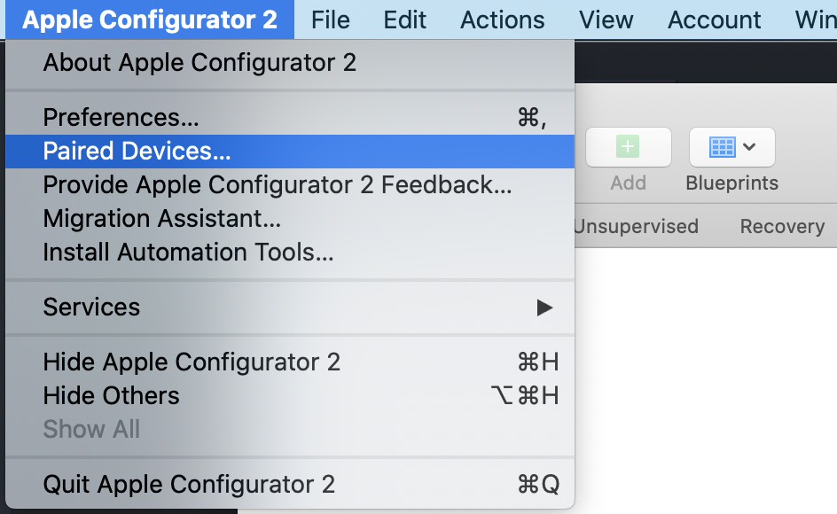
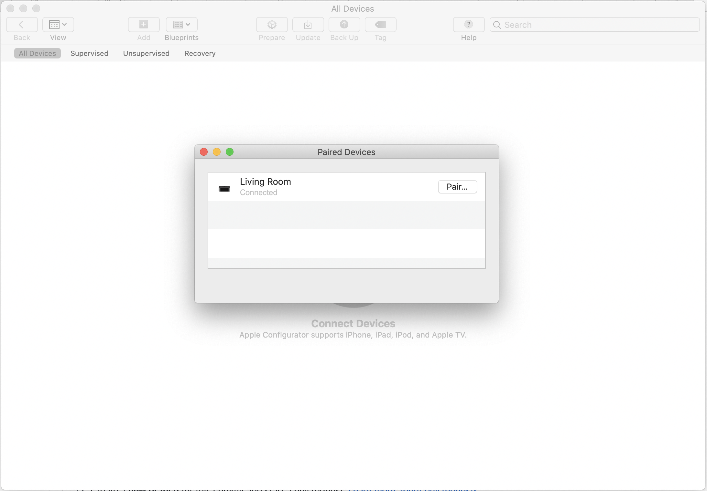
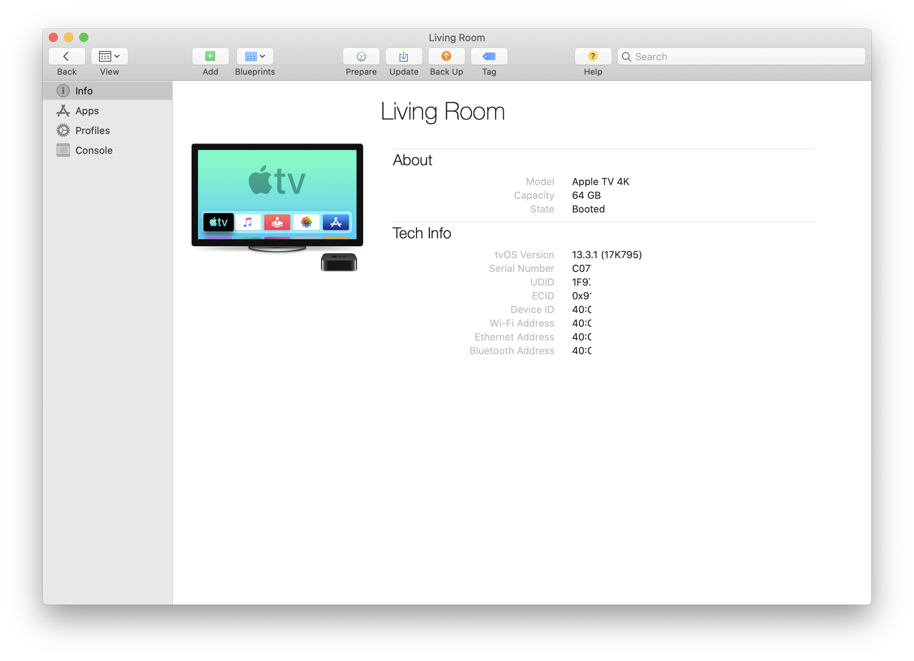
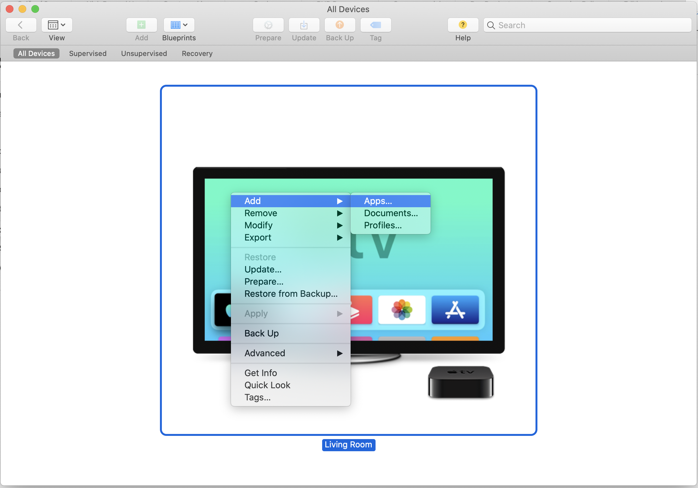
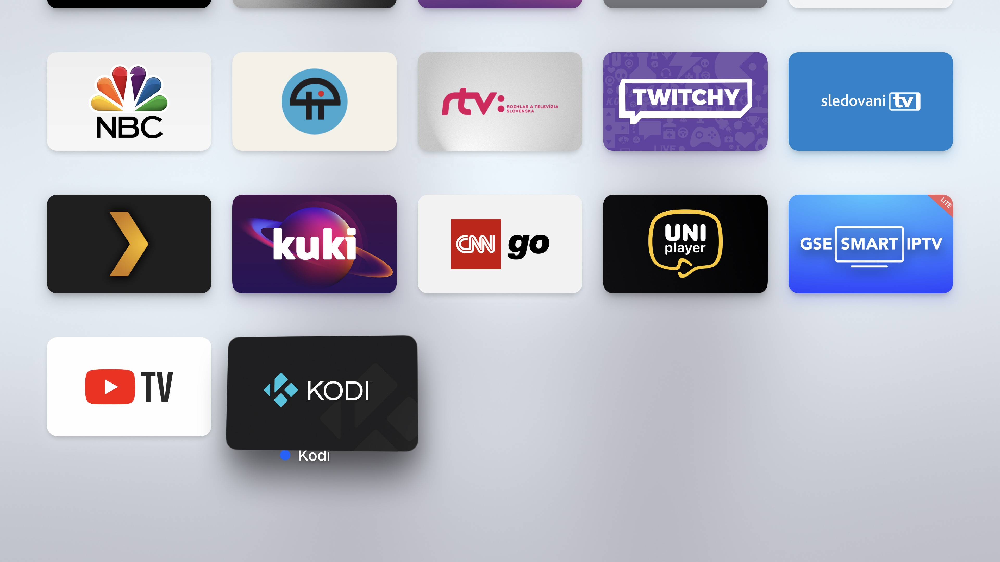

## Co je homebrew?
Jedná se o typ aplikací, které jsou vytvořené komunitou a nikdy se nedostaly do oficiálních obchodů s aplikacemi, kvůli politice vlastníka systému (Apple).
Proto homebrew "podomácku uvařeno".

## Seznam aplikací
Na Apple TV existuje pár takových skvělých aplikací.
Pro má zařízení si zde nechávám podepsané aplikace mým vývojařským certifikátem

- [Kodi 19 Alpha](https://github.com/MarhyCZ/tvapps/releases/latest/download/Kodi.ipa) (Při prvním spuštění spadla, po druhém již funguje)

## Kde získat UDID Apple TV
1. Z Mac App Store stáhněte aplikaci [Apple Configurator 2](https://apps.apple.com/cz/app/apple-configurator-2/id1037126344?mt=12)
2. Ujistěte se, že počítač s macOS a Apple TV se nacházejí na stejné síti
3. Aplikaci pusťte a v horním panelu klikněte na Apple Configurator 2 - Spárovaná zařízení

3. V Apple TV přejděte do Nastavení -> Ovladače a zařízení -> Aplikace Remote a zařízení
4. Jakmile se ocitnete v této části Nastavení, v aplikaci Apple Configurator se objeví v seznamu Apple TV s možností spárovat

5. Klikněte na "Spárovat", opište PIN z Apple TV a po chvíli bude spárováno. 
6. V hlavním okně aplikace klikněte pravým tlačítkem na Apple TV a vyberte "Informace"
7. V tomto okně vidíte UDID

## Instalace Aplikace

Pokud máte zaregistrované UDID developer účtem a k dispozici správně podepsaný .ipa soubor, stačí jen:

1. Kliknout v Apple Configurator 2 pravým tlačítkem na Apple TV -> Přidat -> Aplikace

2. Vybrat .ipa soubor a vyčkat 20-30s
3. Aplikace je nainstalovaná
